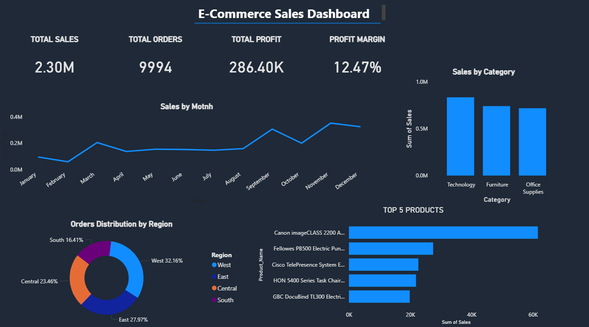

# 📊 Ecommerce Sales Analysis Dashboard

## 🚀 Project Overview

This project analyzes ecommerce sales data using Power BI to uncover key business insights such as revenue trends, profit margins, and top-performing products.

## 📌 Key Insights

* 📈 Total Sales: 2.3M+
* 📦 Total Orders: 9,994
* 💰 Profit Margin: 12.47%
* 🏆 Top Products driving revenue identified
* 🌍 Regional sales distribution analyzed

## 🛠 Tools Used

* Power BI
* Python (Data Cleaning)
* Pandas
* Excel

## 📂 Project Structure

* `data/` → Raw & cleaned datasets
* `notebooks/` → Data cleaning & analysis (Jupyter)
* `dashboard/` → Power BI dashboard files

## 📊 Dashboard Preview

## 🎯 Business Impact

This dashboard helps businesses:

* Track performance trends
* Identify high-profit categories
* Make data-driven decisions

---

⭐ If you like this project, feel free to star the repo!
